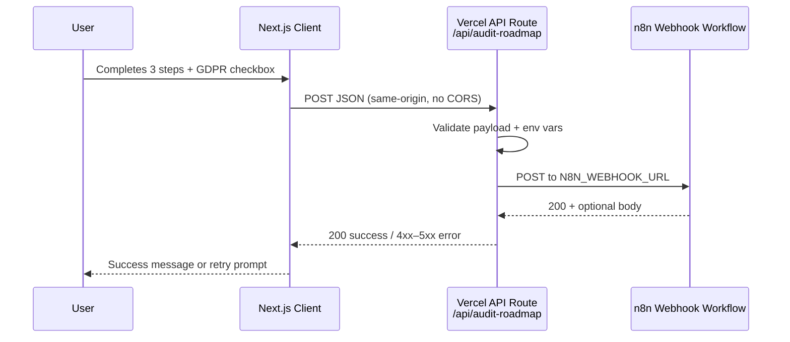

# n8n Webhook Integration — Implementation Plan

> **Goal:** Replace the current lead-capture submit behavior (mock timeout / planned `mailto:`) with a server-side proxy that forwards audit roadmap requests to an n8n workflow via webhook, while collecting contact details and GDPR consent on step 3 of the modal.

**Status:** Plan only — implementation not started  
**Last updated:** 2026-06-09

---

## 1. Current State

| Area | Today |
|------|--------|
| **Entry points** | “Get Started” nav CTA, hero CTA, footer “Quick Audit” — all open `LeadCaptureModal` |
| **Modal flow** | 3 steps in `app/page.tsx`: (1) property address, (2) monthly bill + roof age, (3) contact info |
| **Step 3 fields** | Single “Full Name”, email, phone — **no GDPR checkbox** |
| **Submit button** | “Get My Audit” — calls `handleSubmit()` which fakes a 3s loading state via `setTimeout` |
| **Backend** | None — no `app/api/` routes exist |
| **Hosting** | Next.js 16 on Vercel (Analytics + Speed Insights already installed) |

The product copy you described (“Get My Full Audit RoadMap”) is not in the repo yet; the plan assumes we **rename the final CTA** to match that wording during implementation.

---

## 2. Target Architecture

Browsers cannot call n8n webhooks directly in production without CORS configuration on the n8n side. Since we are **not** adding Supabase or another backend, we use a **Vercel Serverless API Route** as a thin proxy.



**Why a proxy instead of client → n8n?**

- Keeps the webhook URL **secret** (server-only env var).
- Avoids n8n CORS setup and exposes a single, controlled contract.
- Allows validation, optional auth header, and rate limiting in one place.

---

## 3. Environment Variables

### Required (Vercel + local)

| Variable | Scope | Description |
|----------|--------|-------------|
| `N8N_WEBHOOK_URL` | **Server only** | Full n8n webhook URL (Production + Preview URLs differ in n8n — set both in Vercel if needed) |

> **Note:** You wrote `N8N_WEBOOK_URL` — use **`N8N_WEBHOOK_URL`** (correct spelling). Document both in team notes so nobody copies the typo.

### Recommended (optional hardening)

| Variable | Scope | Description |
|----------|--------|-------------|
| `N8N_WEBHOOK_SECRET` | Server only | Shared secret sent as `Authorization: Bearer <secret>` or `X-Webhook-Secret` — configure matching validation in n8n |
| `AUDIT_SUBMIT_RATE_LIMIT` | Server only | Max submissions per IP per hour (e.g. `5`) — simple in-memory or Vercel KV later |

### Local development

Create `.env.local` (already gitignored via `.env*.local`):

```env
N8N_WEBHOOK_URL=https://your-n8n.example.com/webhook/audit-roadmap
# N8N_WEBHOOK_SECRET=your-shared-secret
```

Add `.env.example` at repo root with **placeholder keys only** (no real URLs) for onboarding.

**Never** prefix webhook URLs with `NEXT_PUBLIC_` — that would leak them to the browser bundle.

---

## 4. API Route Design

### File

`app/api/audit-roadmap/route.ts`

### Method

`POST` only. Return `405` for other methods.

### Request body (JSON)

```typescript
{
  firstName: string
  lastName: string
  email: string
  gdprConsent: boolean          // must be true
  address: string               // from step 1
  monthlyBill: number           // from step 2 slider
  roofAge: string | number      // from step 2
  phone?: string                // optional — see §6
  source?: string               // e.g. "lead-capture-modal"
  submittedAt?: string          // ISO timestamp — set server-side preferred
}
```

### Server-side validation

Use **Zod** (already in `package.json`) to:

- Require non-empty `firstName`, `lastName`, `email`
- Validate email format
- Reject unless `gdprConsent === true`
- Sanitize string lengths (max lengths to prevent abuse)
- Optionally require `phone` if business still needs it

### n8n forward payload

Forward a **normalized** object (can match request body plus metadata):

```typescript
{
  firstName, lastName, email, gdprConsent,
  address, monthlyBill, roofAge, phone,
  source: "zenith-solar-audit",
  submittedAt: new Date().toISOString(),
  userAgent?: string,   // from request headers — optional
  referer?: string
}
```

### Responses

| Status | When | Client behavior |
|--------|------|-----------------|
| `200` | n8n accepted | Show success state; close modal |
| `400` | Validation failed | Inline field errors |
| `429` | Rate limit (if implemented) | “Try again later” |
| `502` | n8n unreachable or non-2xx | Generic error + retry |
| `500` | Missing `N8N_WEBHOOK_URL` | Log server-side; user sees generic error |

Do **not** return n8n internal error details to the client.

### Implementation sketch

```typescript
// app/api/audit-roadmap/route.ts
import { NextRequest, NextResponse } from "next/server"
import { z } from "zod"

const schema = z.object({
  firstName: z.string().min(1).max(100),
  lastName: z.string().min(1).max(100),
  email: z.string().email().max(254),
  gdprConsent: z.literal(true),
  address: z.string().min(1).max(500),
  monthlyBill: z.number().min(50).max(500),
  roofAge: z.union([z.string(), z.number()]),
  phone: z.string().max(30).optional(),
})

export async function POST(req: NextRequest) {
  const webhookUrl = process.env.N8N_WEBHOOK_URL
  if (!webhookUrl) {
    console.error("N8N_WEBHOOK_URL is not configured")
    return NextResponse.json({ error: "Service unavailable" }, { status: 500 })
  }

  const parsed = schema.safeParse(await req.json())
  if (!parsed.success) {
    return NextResponse.json({ error: "Invalid submission" }, { status: 400 })
  }

  const headers: Record<string, string> = { "Content-Type": "application/json" }
  const secret = process.env.N8N_WEBHOOK_SECRET
  if (secret) headers["Authorization"] = `Bearer ${secret}`

  const res = await fetch(webhookUrl, {
    method: "POST",
    headers,
    body: JSON.stringify({ ...parsed.data, submittedAt: new Date().toISOString() }),
  })

  if (!res.ok) {
    console.error("n8n webhook failed", res.status, await res.text())
    return NextResponse.json({ error: "Submission failed" }, { status: 502 })
  }

  return NextResponse.json({ ok: true })
}
```

---

## 5. Frontend Changes (`LeadCaptureModal` in `app/page.tsx`)

### 5.1 Step 3 — Contact & compliance

| Change | Detail |
|--------|--------|
| Split name | Replace single `name` with `firstName` + `lastName` |
| Email | Keep required |
| Phone | **Recommendation:** make **optional** unless sales requires it — you did not list phone in requirements |
| GDPR checkbox | Required; link to privacy policy URL (placeholder `#privacy` until page exists) |
| Button label | Rename to **“Get My Full Audit Roadmap”** |
| Submit disabled until | `firstName`, `lastName`, valid `email`, `gdprConsent === true` (+ optional phone if kept required) |

Use existing `Checkbox` from `@/components/ui/checkbox` with `Label` for accessible pairing (`htmlFor` + `id`).

Suggested GDPR copy:

> I agree to Zenith Solar processing my data to deliver my audit roadmap and related communications. [Privacy Policy](#privacy)

### 5.2 Submit handler

Replace `setTimeout` mock with:

```typescript
const res = await fetch("/api/audit-roadmap", {
  method: "POST",
  headers: { "Content-Type": "application/json" },
  body: JSON.stringify({ ...formData, gdprConsent }),
})
```

- Keep existing loading UI (`Loader2` + “Running Engineering Audit…”).
- On success: toast via **Sonner** (already installed) + reset form + close modal.
- On failure: toast with retry-friendly message; stay on step 3 with fields preserved.

### 5.3 Client validation

Mirror server rules with Zod (or react-hook-form + `@hookform/resolvers/zod`) to reduce round trips. Optional but aligns with existing dependencies.

### 5.4 Honeypot (recommended)

Add hidden `website` field — if filled, API silently returns `200` without calling n8n (bot trap).

---

## 6. Suggested Improvements & Decisions

| # | Suggestion | Rationale |
|---|------------|-----------|
| 1 | **Include all 3 quiz answers in webhook** | n8n can personalize the roadmap email/CRM without a second lookup |
| 2 | **`N8N_WEBHOOK_SECRET`** | Prevents arbitrary POSTs if webhook URL leaks |
| 3 | **Optional phone** | Reduces form friction; add back if legally/operationally required |
| 4 | **`.env.example`** | Documents required vars without committing secrets |
| 5 | **Extract modal to `components/lead-capture-modal.tsx`** | `app/page.tsx` is ~900 lines — easier to test and review |
| 6 | **Privacy policy page or anchor** | GDPR checkbox should link to real policy before go-live |
| 7 | **Idempotency** | n8n can dedupe by `email + submittedAt` window if users double-click |
| 8 | **Vercel env per environment** | Production vs Preview webhooks — avoid test data in live CRM |
| 9 | **Logging** | Log failures server-side only; never log full PII in production logs |
| 10 | **Button copy consistency** | Align hero/nav CTAs with “Audit Roadmap” language if desired |

**Open product question:** Keep phone as required, optional, or remove? Plan defaults to **optional** unless you confirm otherwise.

---

## 7. n8n Workflow Setup (ops checklist)

1. Create workflow: **Webhook** trigger → **Set** / **Function** node → downstream actions (email, CRM, Slack, etc.).
2. Webhook settings:
   - Method: `POST`
   - Response: `200` with `{ "received": true }` (or empty body)
   - Authentication: Header Auth if using `N8N_WEBHOOK_SECRET`
3. Map incoming JSON fields to email template / CRM columns.
4. Activate workflow and copy **Production URL** into Vercel `N8N_WEBHOOK_URL`.
5. Test with curl before connecting the site:

```bash
curl -X POST "$N8N_WEBHOOK_URL" \
  -H "Content-Type: application/json" \
  -d '{"firstName":"Test","lastName":"User","email":"test@example.com","gdprConsent":true,"address":"123 Main St","monthlyBill":150,"roofAge":"10"}'
```

---

## 8. Security & Compliance

- **GDPR:** Store consent flag + timestamp in n8n/CRM; checkbox must be unchecked by default.
- **Secrets:** Webhook URL and secret only in Vercel project settings / `.env.local`.
- **PII:** HTTPS only (Vercel default). Limit what appears in client-side errors.
- **Rate limiting:** Consider `@upstash/ratelimit` or simple IP throttle if spam appears.
- **CORS:** Not needed for browser → `/api/audit-roadmap` (same origin).

---

## 9. Implementation Tasks (ordered)

| Step | Task | Files |
|------|------|-------|
| 1 | Add `.env.example` with `N8N_WEBHOOK_URL` | `.env.example` | ✅ |
| 2 | Create Zod schema shared or duplicated client/server | `lib/audit-roadmap-schema.ts` | ✅ |
| 3 | Implement API route | `app/api/audit-roadmap/route.ts` | ✅ |
| 4 | Update modal: first/last name, GDPR, submit to API | `components/lead-capture-modal.tsx` | ✅ |
| 5 | Wire Sonner toasts for success/error | `app/layout.tsx` | ✅ |
| 6 | Rename CTA to “Get My Full Audit Roadmap” | `components/lead-capture-modal.tsx` | ✅ |
| 7 | Configure Vercel env vars + redeploy | Vercel dashboard | 🔲 Manual |
| 8 | Build & test n8n workflow | n8n | 🔲 Manual |
| 9 | E2E manual test on Preview deployment | — | 🔲 Manual |

---

## 10. Test Plan

### Local

- [ ] Missing `N8N_WEBHOOK_URL` → API returns 500, user sees friendly error
- [ ] Invalid email / missing GDPR → 400, form shows validation
- [ ] Valid payload → n8n execution appears in n8n “Executions”
- [ ] Network failure to n8n → 502, user can retry

### Production

- [ ] Submit from live domain; confirm CRM/email receives all fields
- [ ] GDPR unchecked → submit blocked client-side; API rejects if bypassed
- [ ] Double-submit / rapid clicks → no duplicate emails (n8n or UI debounce)

---

## 11. Deployment (Vercel)

1. Project → **Settings → Environment Variables**
2. Add `N8N_WEBHOOK_URL` for Production (and Preview if testing)
3. Optionally add `N8N_WEBHOOK_SECRET`
4. Redeploy (env changes require redeploy)
5. Smoke-test Preview URL before promoting

---

## 12. Out of Scope (this iteration)

- Admin dashboard on the website
- Supabase / database persistence
- User account or login
- Automated email content design inside Next.js (handled in n8n)

---

## 13. Summary

We will add a single Vercel API route that validates lead data and forwards it to n8n, update step 3 of the existing 3-question modal with first name, last name, email, and a mandatory GDPR checkbox, and replace the mock submit with a real fetch to `/api/audit-roadmap`. The webhook URL lives in `N8N_WEBHOOK_URL` (server-only). Optional secret header and rate limiting are recommended before high traffic.

**Next step after plan approval:** Implement tasks in §9 in order.
